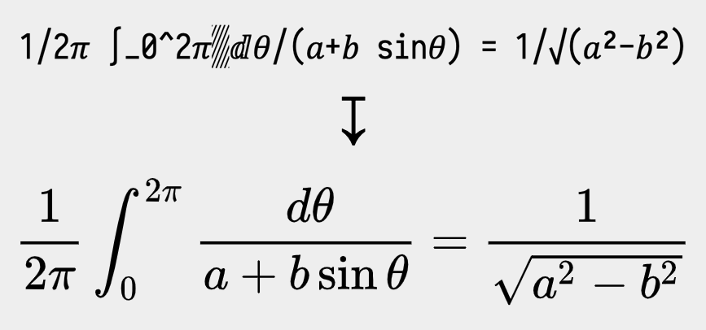

# UnicodeMathML

*This repository provides a JavaScript-based translation of [UnicodeMath](https://www.unicode.org/notes/tn28/) to [MathML](https://developer.mozilla.org/en-US/docs/Web/MathML) (hence "UnicodeMathML"). An interactive playground allows for experimentation with UnicodeMath's syntax and insight into the translation pipeline. UnicodeMathML can be easily integrated into arbitrary HTML or [Markdeep](https://casual-effects.com/markdeep/) documents.*

#### 🎮 Get familar with the syntax via [the playground](https://doersino.github.io/UnicodeMathML/playground.html)!

#### 📑 [Learn how to](#getting-started) integrate UnicodeMathML into your website or Markdeep document.

UnicodeMath is an **easy-to-read linear format** for mathematics initially developed as an input method and interchange representation for Microsoft Office. Its author, Murray Sargent III, has published a [*Unicode Technical Note*](https://www.unicode.org/notes/tn28/) detailing the format, based on which this UnicodeMath to MathML translator was built. *More in the FAQ section below.*




## Getting Started

For a first look, check out...

* ...the [UnicodeMathML playground](), an interactive environment that allows you to play around with UnicodeMath's syntax and its translation into MathML.
* ...an [example Markdeep document](https://doersino.github.io/UnicodeMathML/markdeep-integration/markdeep.md.html) whose source can be found [here](https://github.com/doersino/UnicodeMathML/blob/master/markdeep-integration/markdeep.md.html).
* ...or an [example HTML document](https://doersino.github.io/UnicodeMathML/markdeep-integration/html.html) whose source is located [here](https://github.com/doersino/UnicodeMathML/blob/master/markdeep-integration/html.html).

Depending on whether you'd like to write UnicodeMath in a Markdeep document or use UnicodeMathML on your website, there are two paths. But first:

1. Clone this repository or [download a ZIP](https://github.com/doersino/UnicodeMathML/archive/master.zip).

    ```
    git clone https://github.com/doersino/UnicodeMathML.git
    ```

### HTML

TODO::: maybe all the necessary stuff for use into dist?

TODO how to embed into an html page, how to run on arbitrary text

TODO how to use in conjunction with mathjax? (see asciimathml readme for reference)

TODO server-side rendering: how to use in node? ("it's all basic javascript, pegjs doesn't require a runtime, you'll figure it out!")

### Markdeep

TODO how to do it


## FAQ

Got **further questions** that aren't answered below, or ideas for **potential improvements**, or **found a bug**? *Feel free to [file an issue](https://github.com/doersino/UnicodeMathML/issues)!*


### What's this *UnicodeMath* you're talking about?

UnicodeMath is an linear format for mathematics initially developed as an input method and interchange representation for Microsoft Office. By using Unicode symbols in lieu of keywords wherever possible, it's significantly more readable than established/competing formats in plain text:

TODO a single example, table further down

TODO good running example: fourier transform

TODO more from thesis/presentation – maybe refer to it outright

Its author, Murray Sargent III, has published a [*Unicode Technical Note*](https://www.unicode.org/notes/tn28/) detailing the format, based on which this UnicodeMath to MathML translator was built.


### How does its syntax compare to AsciiMath, LaTeX, and MathML?

Here's a table showing a few formulas as you'd write them in UnicodeMath, AsciiMath and LaTeX, along with rendering examples:

TODO table, see thesis page 17

To summarize, here's a totally-not-biased-and-super-scientific evaluation of these formats:

TODO comparison table: latex vs asciimath vs unicodemath on three star scale, with "source readability" 1 2 3, "ease of input" 2 3 1 or so, ease of parsing, etc.

TODO thumbsup [this issue](...) if youre interested in an interactive unicodemath tutorial. in the tut, first show examples, then escapes, then text fields with buildup


### Does UnicodeMath support colors, monospaced text and comments?

Not in its canonical form as described in Sargent's tech note (tech note?) – he notes that such features should be delegated to a higher layer (TODO attribute, see thesis page 66), which is perfectly reasonable in GUI-based environments like Microsoft Office – but there is not such layer in HTML/Markdeep.

TODO note on features i've added (colors etc., \u1234, etc., custom control words, doublestruck option, etc.)


### Alright, but I can't find any of these fancy Unicode symbols on my keyboard!

Nobody's keeping you from adapting [Tom Scott's emoji keyboard](https://www.youtube.com/watch?v=lIFE7h3m40U) idea for math.

More realistically, there's a bunch of tooling and text editor plugins that can help out here:

* TODO sublime plugin (note this: https://github.com/mvoidex/UnicodeMath/issues/20)
* TODO other tools (see the ones torsten recommended, macos popup thingy, something for windows?)

Additially, you can configure UnicodeMathML to automatically translate keywords like `\infty` into their respective symbols before processing proper commences.


### Alright, that's not as big of a problem as I feared. What's *MathML*, then?

TODO explain


### Isn't browser support for MathML really lackluster?

Sort of – according to [caniuse.com](https://caniuse.com/#search=mathml), native support for MathML is available for around 21% of users as of late 2020 as only Firefox and Safari currently support MathML.

However, Igalia [is working]() in conjunction with TODO on TODO, which should push this number upwards quite significantly in the coming months and years.

All of this isn't really an issue: [MathJax](TODO), which you'd probably use to render LaTeX math on the web anyway, provides a polyfill for MathML rendering.


### But LaTeX seems more TODO widespread, usable, omnipresent., and KaTeX is so much faster than MathJax!

Yup. For this reason, I've been experimenting with enabling UnicodeMathML to emit LaTeX code, too – most but not all UnicodeMath features are supported at a basic level. TODO link to section

TODO test with katex


## Development

*This section is largely a reminder to myself and other potential contributors.*

UnicodeMathML is intentionally kept simple and doesn't have any dependencies beyond PEG.js – that way, it's easier to maintain and extend.

TODO architecture overview

TODO note on bundling, generating parser and storing it in static file

TODO note: when running playground on your local machine in chrome (TODO other browsers?), make sure to either
* spin up a `python -m SimpleHTTPServer 8000` to circumvent pegjs grammar file loading being prevented due to same-origin policy stuff (TODO still current?)
* open chrome (on macos anyway) with `open -a Google\ Chrome --args --disable-web-security --user-data-dir`
* set the `security.fileuri.strict_origin_policy` key on `about:config` in Firefox to `false`
TODO see https://gist.github.com/willurd/5720255
TODO note that there's a reason playground is located at the root: were it in a subdirectory, it couldn't access ../ stuff when served directly from the file system due to same origin policy
TODO is this all still necessary? nope? test by moving playground to subfolder?


## Related Work

* TODO see https://github.com/arnog/mathlive/blob/316023b89aa6ee5ba8f417bb016ccb2648f9a21f/src/editor/parse-math-string.ts#L23
* TODO https://github.com/runarberg/mathup
* TODO https://github.com/michael-brade/LaTeX.js


## License

You may use this repository's contents under the terms of the *MIT License*, see `LICENSE`.

However, the subdirectories `lib/` and `playground-assets/lib/` contain some **third-party software with its own licenses**:

* The parser generator [PEG.js](https://github.com/pegjs/pegjs), a copy of which is located at `lib/peg-0.10.0.min.js`, is licensed under the *MIT License*, see [here](https://github.com/pegjs/pegjs/blob/master/LICENSE).
* Morgan McGuire's [Markdeep](https://casual-effects.com/markdeep/), which – along with a slightly modified variant that integrates with UnicodeMathML – is located at `lib/markdeep-1.11-orig.js`, is licensed under the *BSD 2-Clause "Simplified" License*, see [here](https://casual-effects.com/markdeep/#license).
* Markdeep includes Ivan Sagalaev's [highlight.js](https://highlightjs.org) with its *BSD 3-Clause License*, see [here](https://github.com/highlightjs/highlight.js/blob/master/LICENSE).
* [JQuery](https://jquery.com), which powers some of the interactions in the UnicodeMathML playground and resides at `playground-assets/lib/jquery.min.js`, is licensed under the *MIT License*, see [here](https://jquery.org/license/).
* A stripped-down variant of [MathJax](https://www.mathjax.org) is included at `playground-assets/lib/mathjax/`, it's licensed under the *Apache License 2.0*, see [here](https://github.com/mathjax/MathJax/blob/master/LICENSE).
* [LM Math](http://www.gust.org.pl/projects/e-foundry/lm-math/download/index_html), the typeface used for rendered UnicodeMath expressions in the playground in browsers with native MathML support, can be found at `playground-assets/lib/latinmodern/` and is licensed under the *GUST Font License*, see [here](http://www.gust.org.pl/projects/e-foundry/licenses/GUST-FONT-LICENSE.txt/view).
* Belleve Invis' excellent typeface [Iosevka](https://github.com/be5invis/Iosevka) is located at `playground-assets/lib/iosevka/` and licensed under the *SIL OFL Version 1.1*, see [here](https://github.com/be5invis/Iosevka/blob/master/LICENSE.md).
